Student Name: Godfrey Jonas
Student ID: 101498962
Assignment: Lab 3

-----------First Attempt of the Lab 3---------------------------------
## Removing unused containers
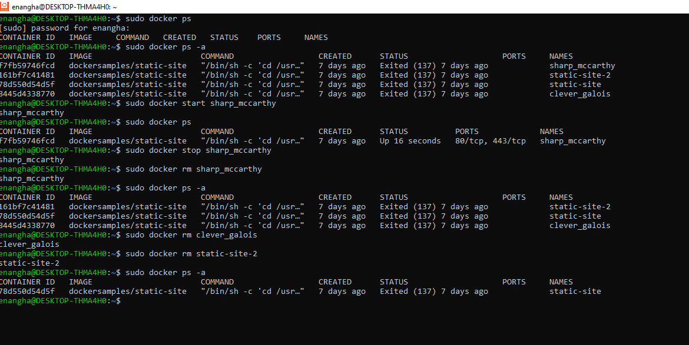

## Installing Minicube
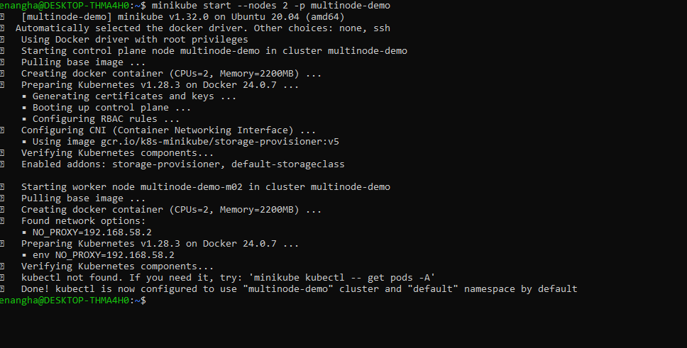

## Instaalling Kubectl
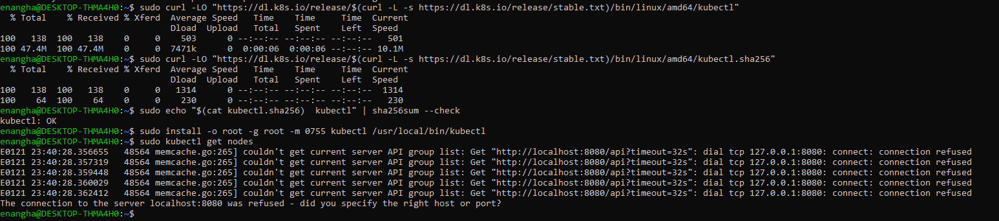

## Minikube status
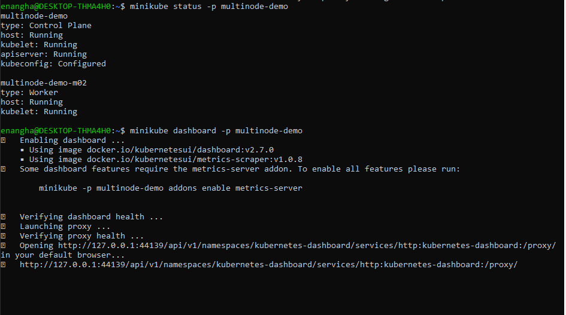

## Minikube Dashboard
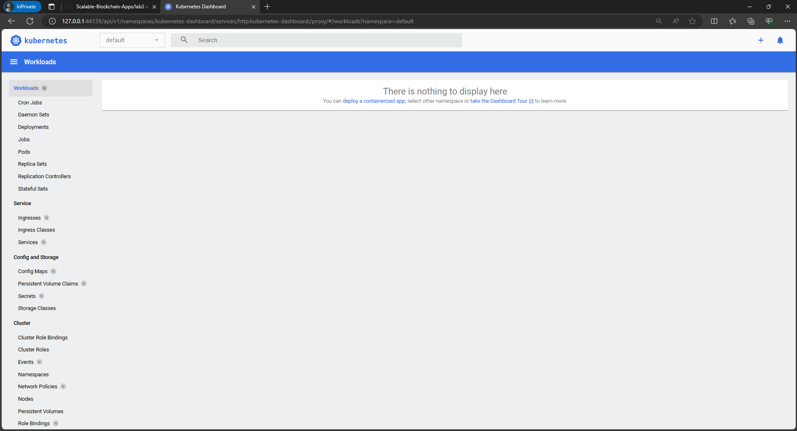

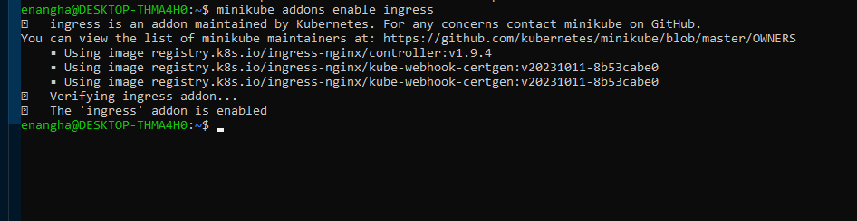

------------END------------------------------------------------------

---------------SECOND ATTEMPT---------------------------------------
## Steps Applied

## Download and Install Minikube
## Download and install Kubectl service

## Getting nodes
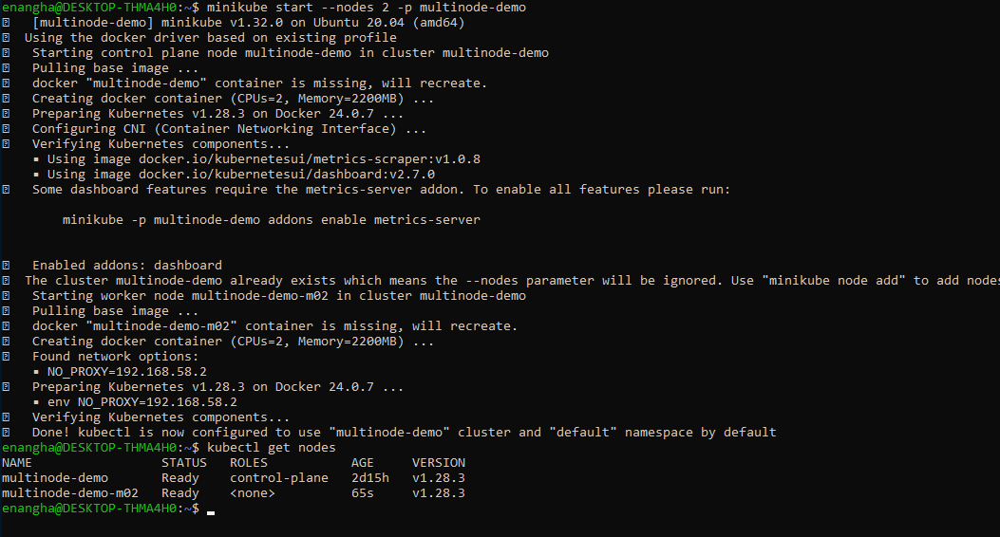

## Check status
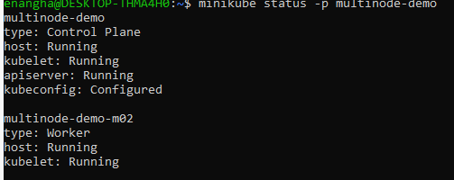

## View Dashboard
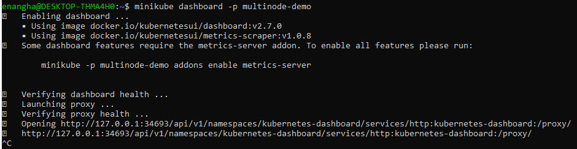

## Stop Multinode service
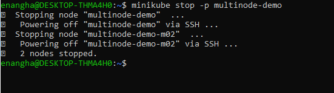

## Delete all
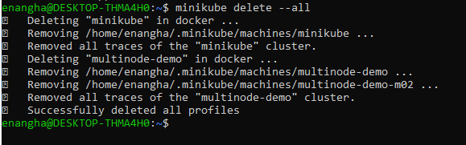

## DEPLOYING MERN APP To K8s (Minikube)

## Clone the repo and navigate to the folder
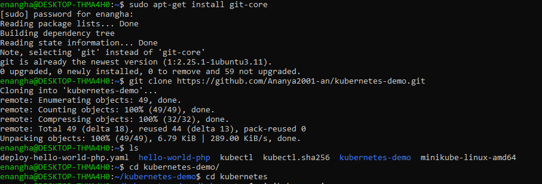

## Start Minikube
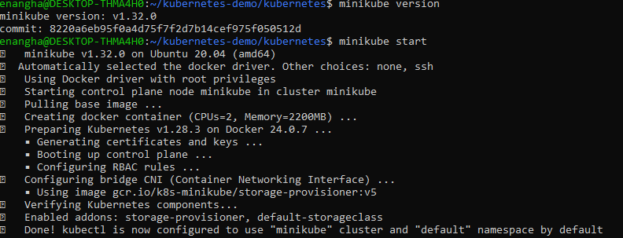

## Create mongodb admin username and password
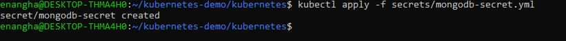

## Created mongodb stateful state, mongodb internal service, deploy server, server internal service for communication btw frontend and backend,
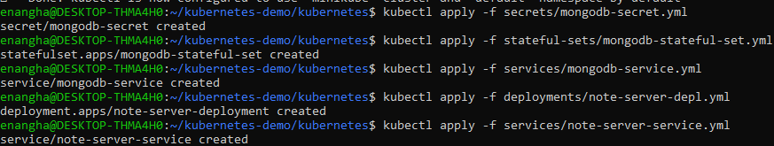

## Clone front end and backend, then deployed them
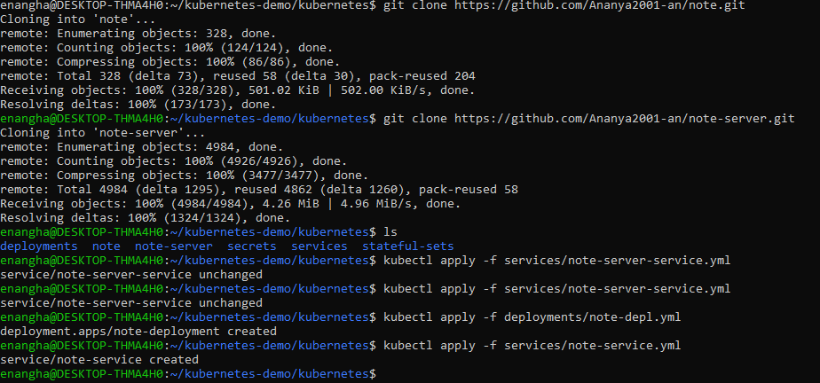

## To get an external IP
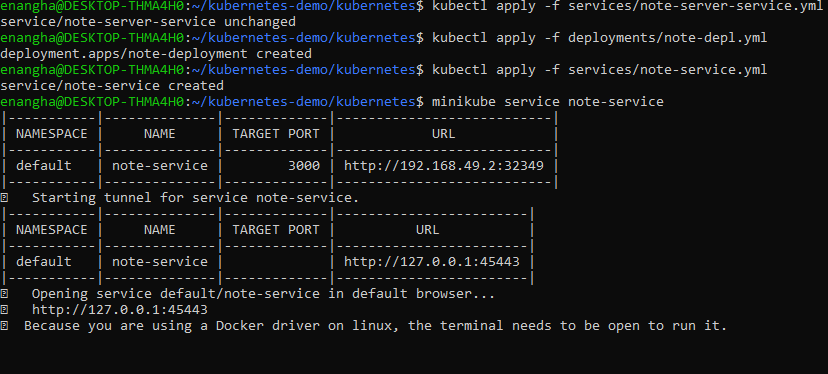

## To get an external IP assigned to the frontend deployment
http://127.0.0.1:45443
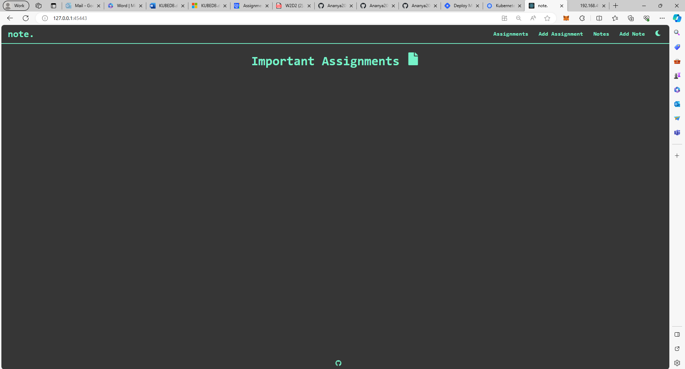

## To run the data mongodb
http://127.0.0.1:35499
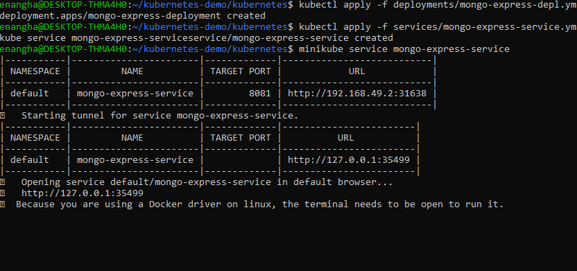

## ------Task--------------
## List all pods and delete
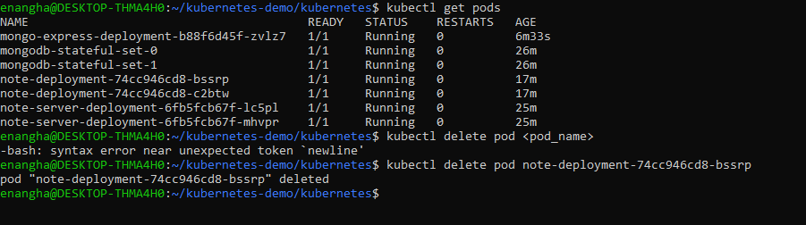

## One Pod was deleted and a new pod was started.
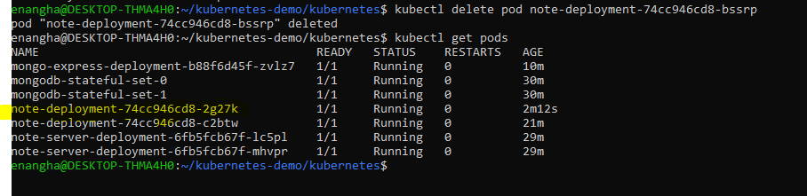

------------ END -------------------------------------------------