-----  Helm & Prometheus ----------

## Add helm repo and repo update

## Prometheus installation

## Check Prometheus status

## Get SVC

## Expose port and display IP

---------- Grafana -----------------------

## Display Prometheus dashboard
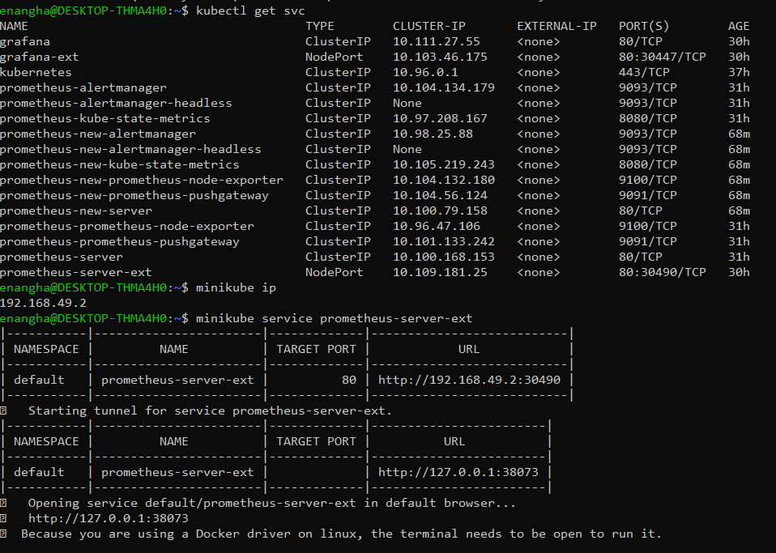

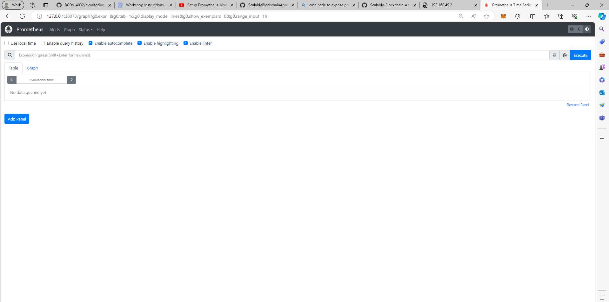

## Install Grafana

## Grafana Login
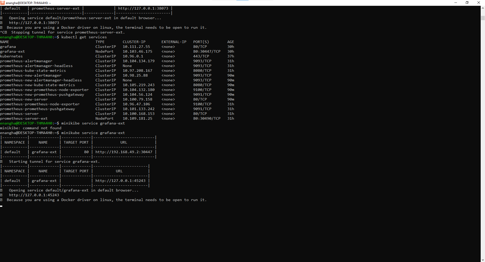

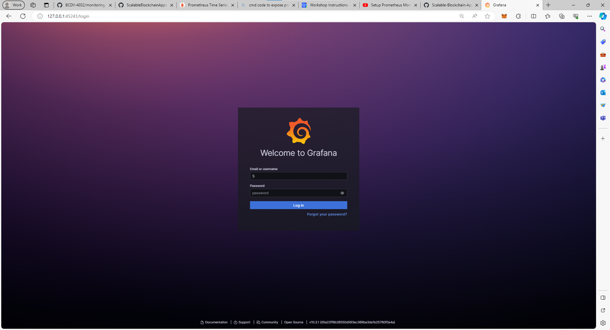

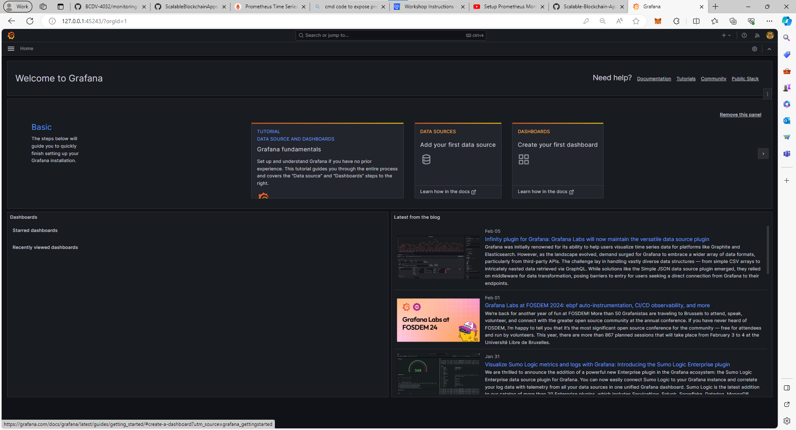

## Click on Add new data source
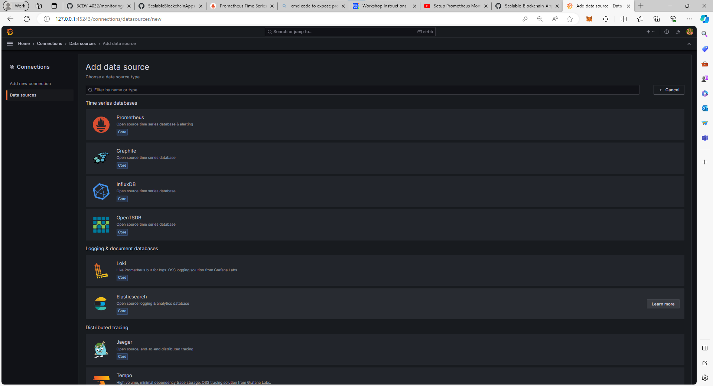

## Entering Credentials

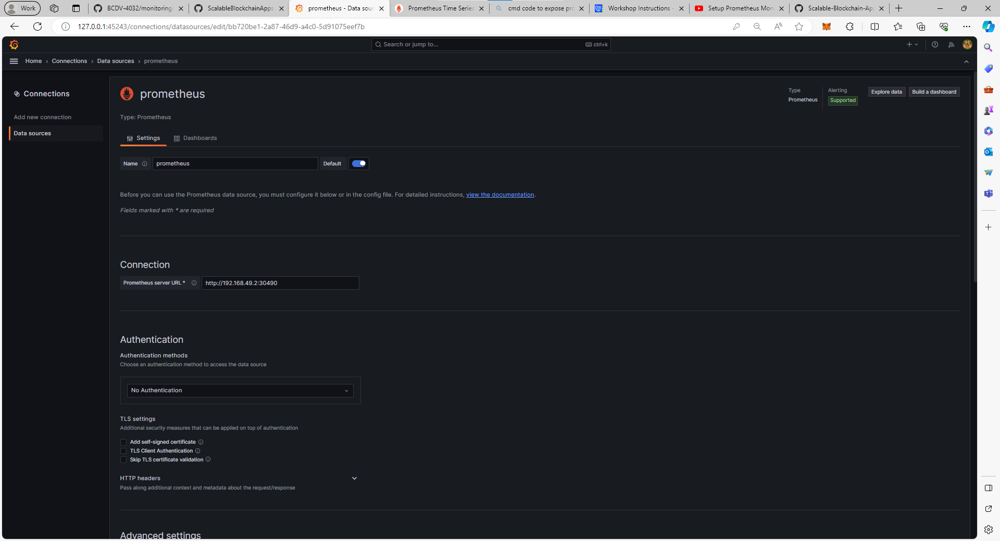

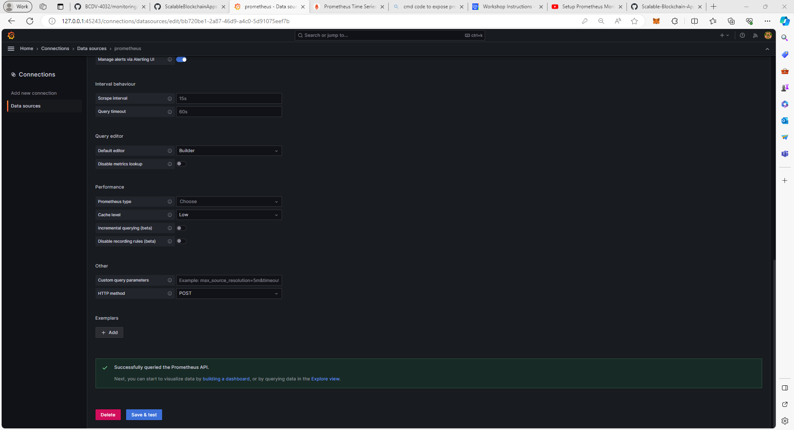

------- Visualization ------------------------------

## Add Visualization
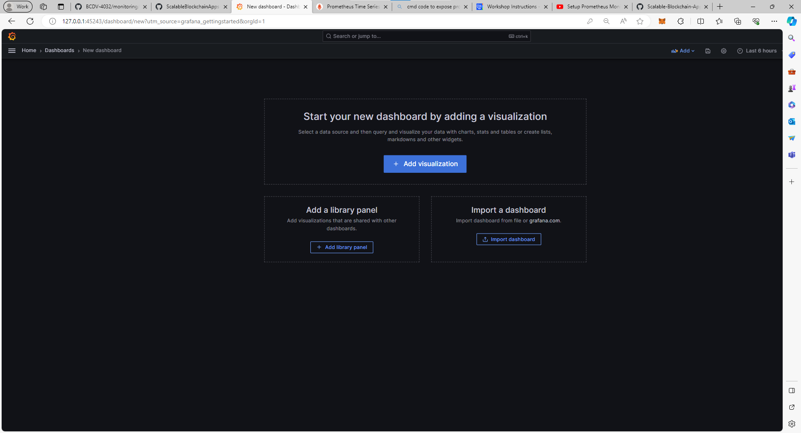

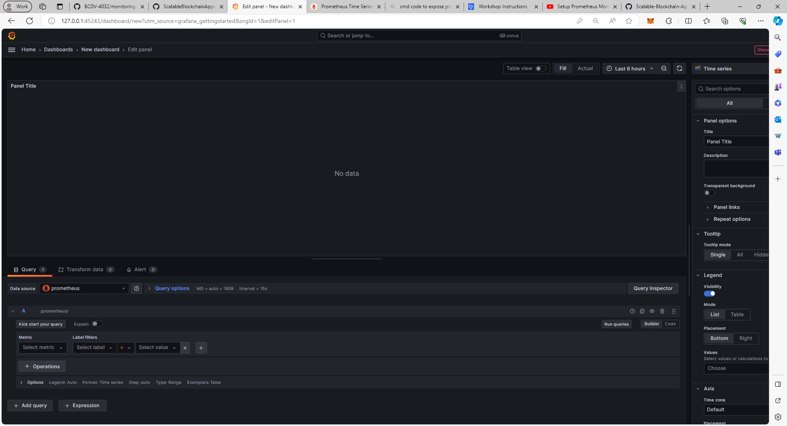

## Import Data
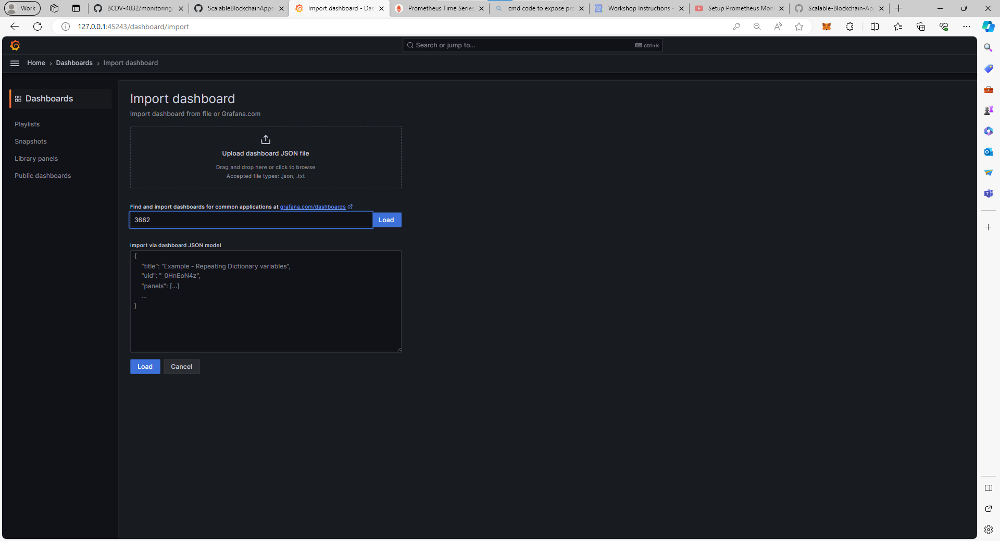

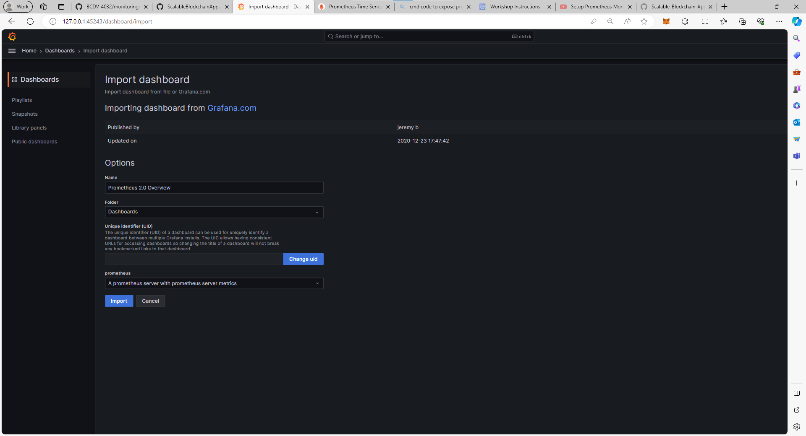

## Grafana Dashboard
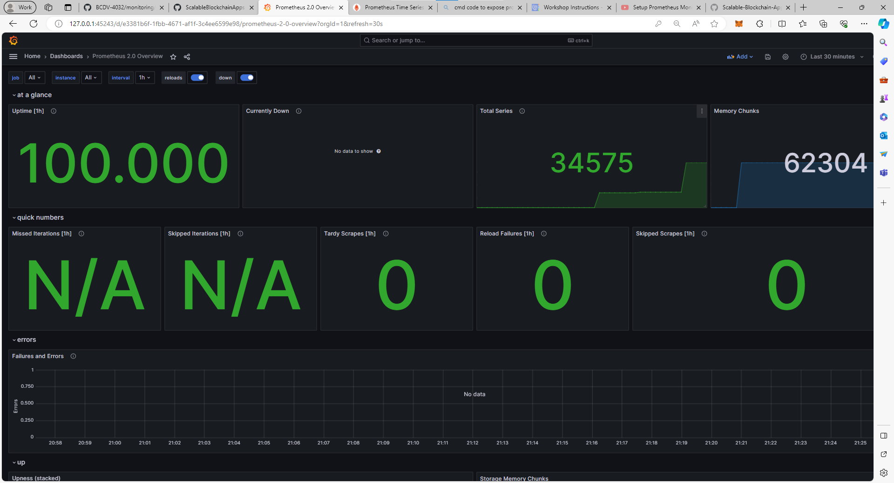

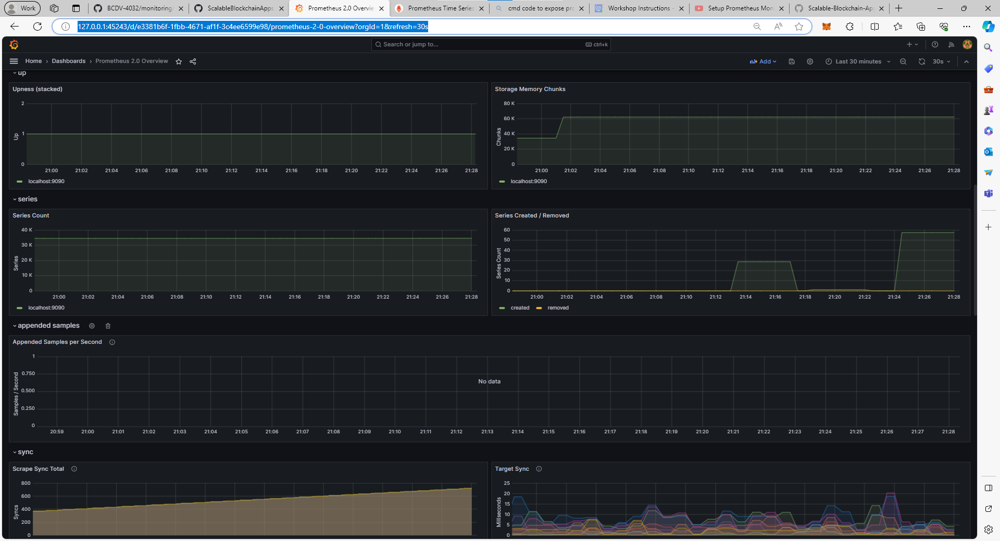

-----------------------------------------------------------

