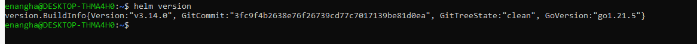
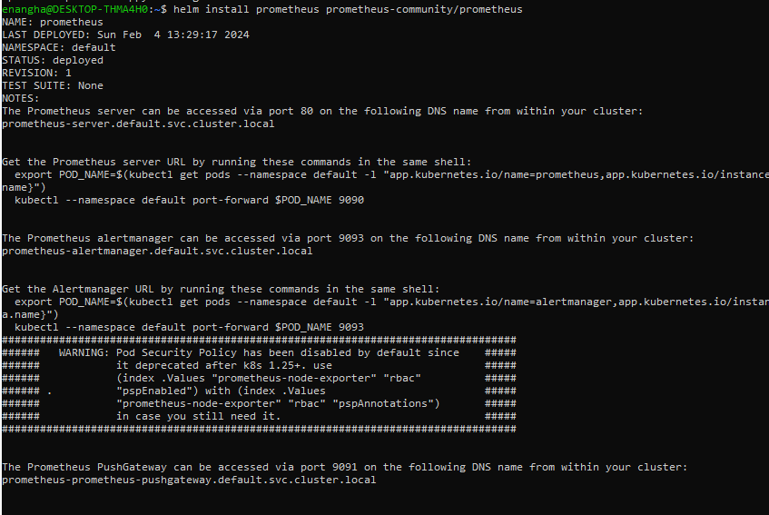
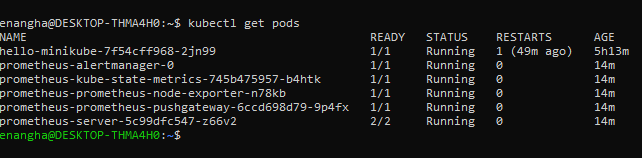
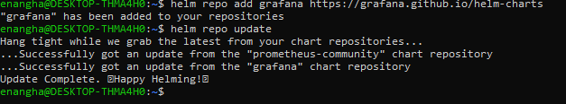
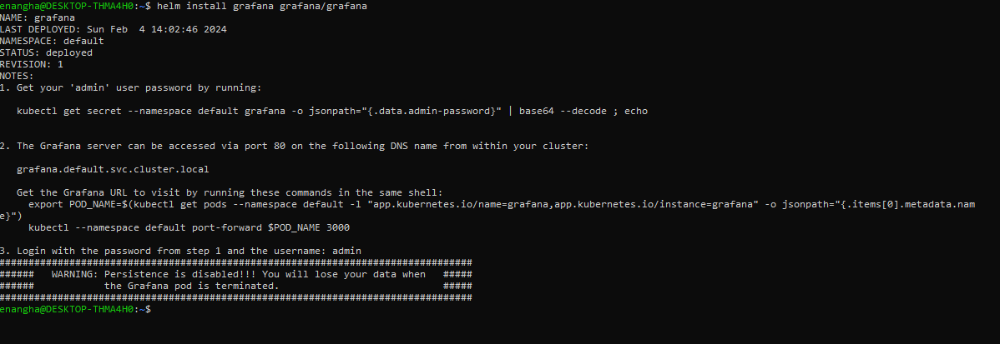

-----  Helm & Prometheus ----------

## Add helm repo and repo update

## Prometheus installation

## Check Prometheus status

## Get SVC

## Expose port and display IP

---------- Grafana -----------------------

## Display Prometheus dashboard

## Install Grafana

## Grafana Login

## Click on Add new data source

## Entering Credentials

------- Visualization ------------------------------

## Add Visualization

## Import Data

## Grafana Dashboard

-----------------------------------------------------------

